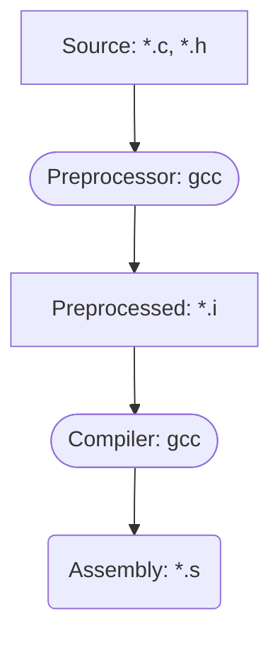

# Notes on **Introduction to Embedded Systems Software and Development Environments**

## Build Process

```mermaid
flowchart TD
    A[Source: *.c, *.h] --> B([Preprocessor: gcc])
    B --> C[Preprocessed: *.i]
    C --> D([Compiler: gcc])
    D --> E(Assembly: *.s)
```
