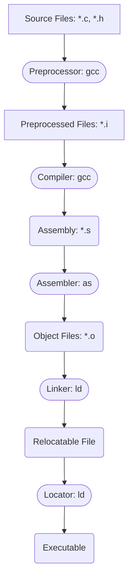

# Notes on **Introduction to Embedded Systems Software and Development Environments**

## Build Process

TODO: add slide 14 details with .a library files?

## Tool Checks
* `ll /usr/bin/*gcc`
    - e.g. `... /usr/bin/gcc -> gcc-7` (native compiler)
* ARCH-VENDOR-OS-ABI
    - e.g. `arm-none-eabi-gcc` (cross compiler)
        * Arch = ARM, Vendor = N/A, OS = None (Bare-Metal), ABI = EABI
    - e.g. `arm-linux-gnueabi-gcc` (cross compiler)
        * Arch = ARM, Vendor = N/A, OS = Linux OS, ABI = GNUEABI

## Compiler Flags
### General
* `-c` compile and assemble; do not link
* `-o <FILE>` compile, assemble, and link
* `-g` generate debug info
* `-Wall` all warning messages
* `-Werror` treat warnings as errors
* `-I<DIR>` include DIR to look for header files
* `-ansi` or `-std=STANDARD` specify standard, e.g. c89, c99
* `-v` verbose
### Architecture Specific
* `-mcpu=[NAME]` specify target ARM processor and architecture, e.g. cortex-m0plus
* `-march=[NAME]` target ARM architecture, e.g. armv7-m, thumb
* `-mtune=[NAME]` target ARM processor, e.g. cortex-m0plus
* `-mthumb` generate code in Thumb States (ISA)
* `-marm` generate code in ARM State (ISA)
* `-mthumb-interwork` generate code that supports calling between ARM and Thumb (ISA)
* `-mlittle-endian` little endian mode
* `-mbig-endian` big endian mode
